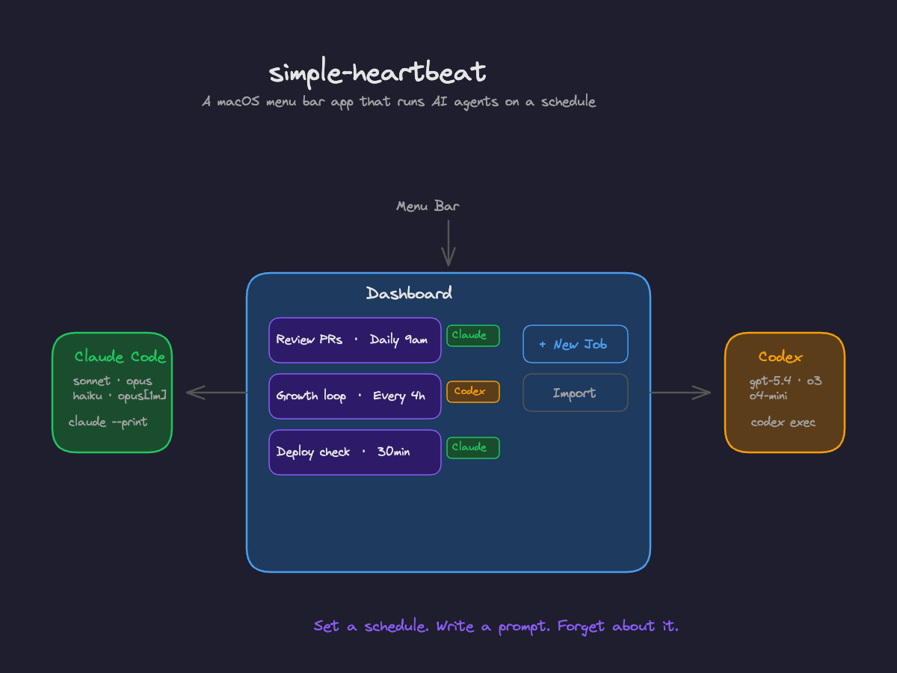
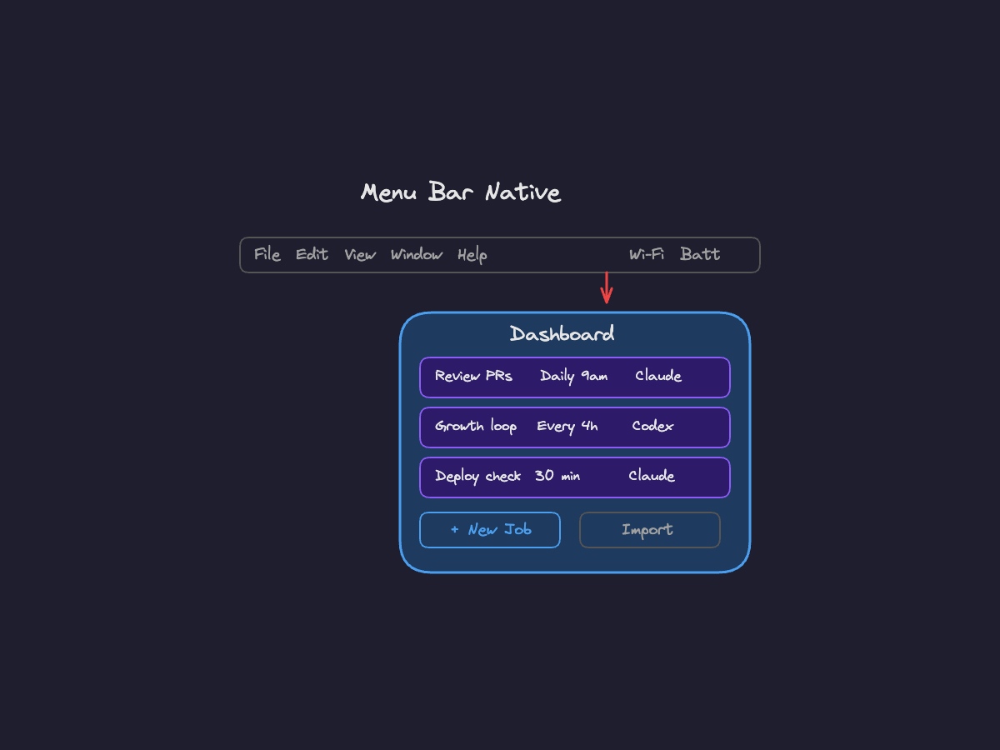
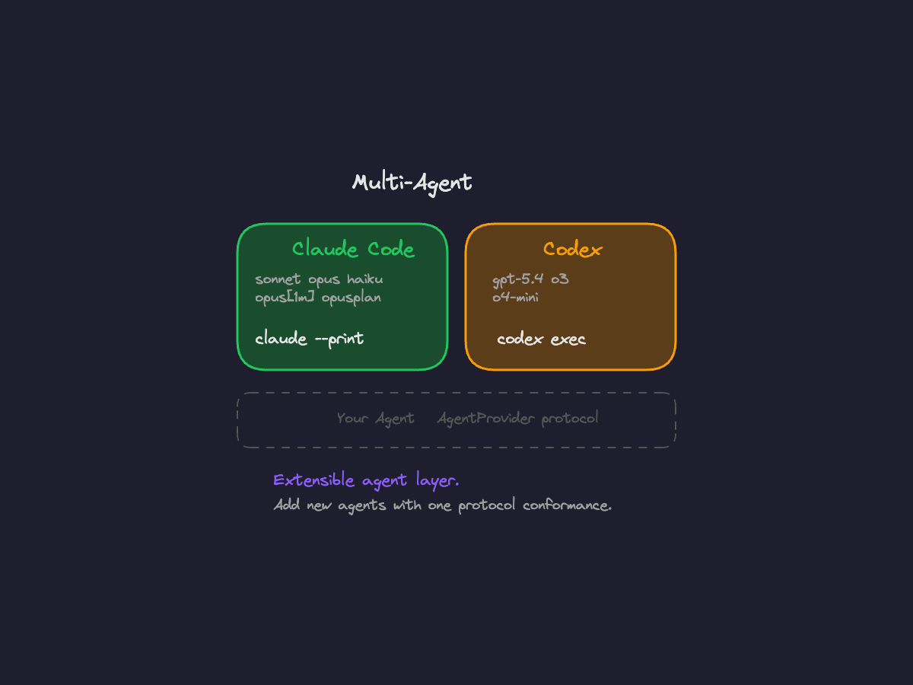
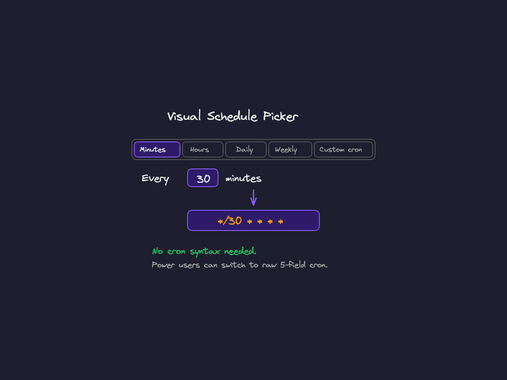
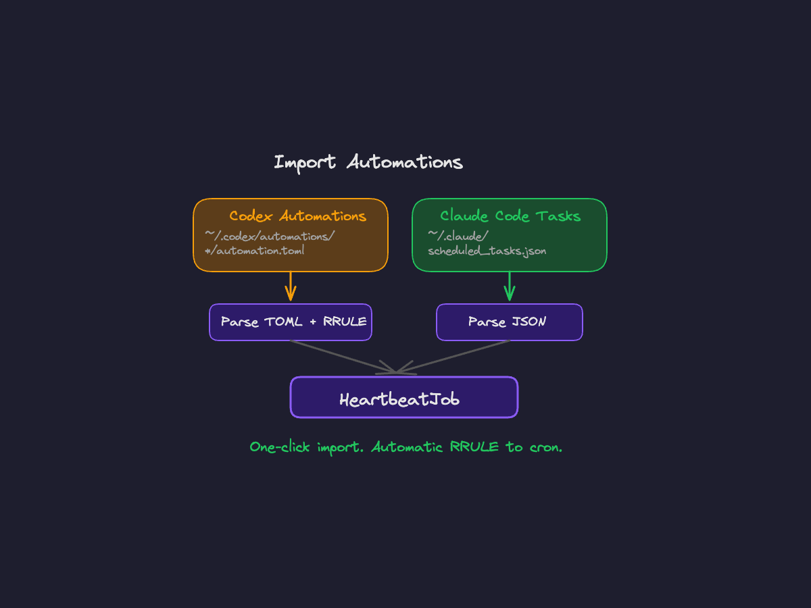
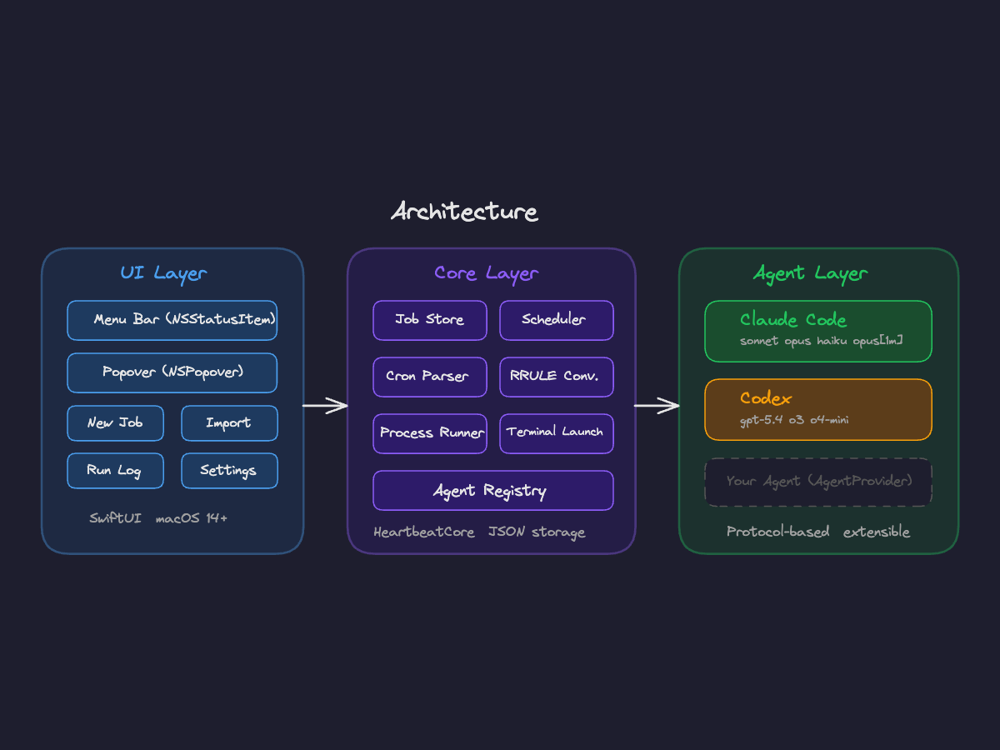
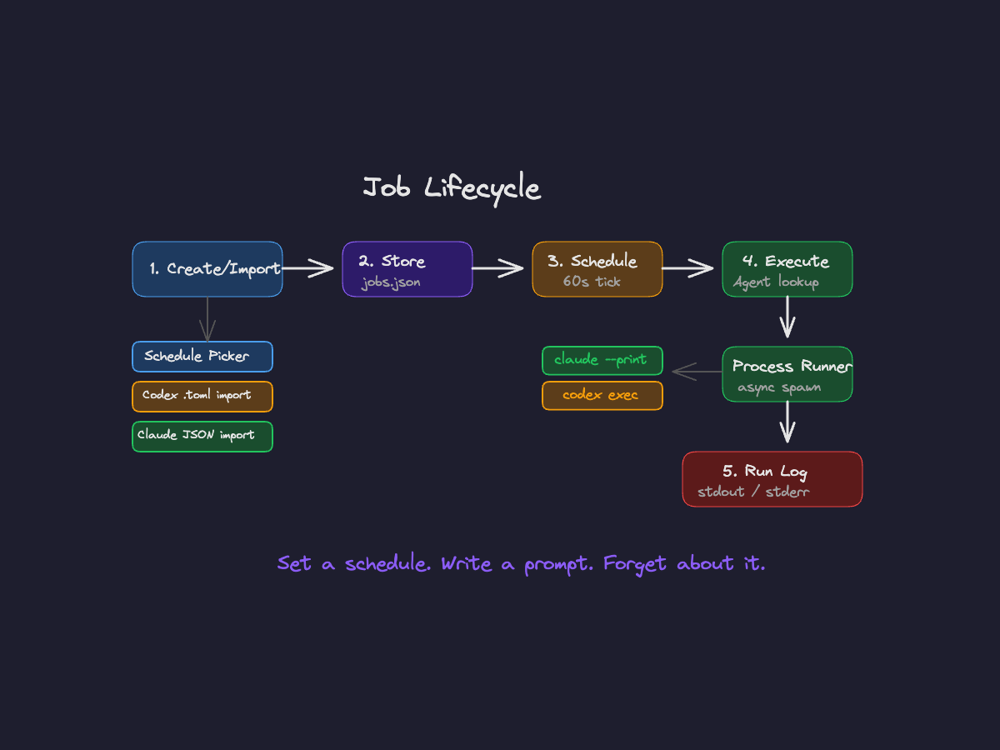

<h1 align="center">simple-heartbeat</h1>
<p align="center">A macOS menu bar app that runs AI coding agents on a schedule</p>

<p align="center">
  
  
  
  
</p>

<p align="center">
  <a href="#features">Features</a> · <a href="#install">Install</a> · <a href="#how-it-works">How It Works</a> · <a href="#adding-agents">Adding Agents</a> · <a href="#tests">Tests</a>
</p>

<p align="center">
  <a href="https://excalidraw.com/#json=R62I6MFCD4IQkqkduSZiv,yW3wzDigqraxnDBO_RW0vg">
    
  </a>
</p>

<p align="center">
  <a href="https://excalidraw.com/#json=R62I6MFCD4IQkqkduSZiv,yW3wzDigqraxnDBO_RW0vg">View interactive diagram</a>
</p>

---

Like a heartbeat, it fires on a schedule — running Claude Code or Codex in the background so you don't have to.

Set up a cron job that reviews your PRs every morning, runs a growth loop daily, or checks your deployment every 30 minutes. Pick a model, write a prompt, set a schedule, forget about it.

## Features

<table>
<tr>
<td width="40%" valign="middle">
<h3>Menu bar native</h3>
Lives in your menu bar with a heart icon. Click to open, click outside to dismiss. No dock icon, no window clutter.
</td>
<td width="60%">
<a href="https://excalidraw.com/#json=BCU-qKU9YvClwhSm6U5T_,RksuiNFf52CFlKWWTj0SHA">

</a>
</td>
</tr>
<tr>
<td width="40%" valign="middle">
<h3>Multi-agent</h3>
Ships with Claude Code and Codex. Normalized agent layer — add new agents by conforming to one protocol.
</td>
<td width="60%">
<a href="https://excalidraw.com/#json=R94L3XXveyFKSiIUzx_0R,A0Y9r9hLKropxPEf09fv5A">

</a>
</td>
</tr>
<tr>
<td width="40%" valign="middle">
<h3>Visual schedule picker</h3>
No cron syntax needed. Pick "Every 30 minutes", "Daily at 9am", or "Weekly on Monday" from dropdowns. Power users can switch to raw cron.
</td>
<td width="60%">
<a href="https://excalidraw.com/#json=9UTDA49t6RrGiHYp3f3Qz,8ZK8UWfc0Y-h-xwk9Ibl1w">

</a>
</td>
</tr>
<tr>
<td width="40%" valign="middle">
<h3>Import from Codex & Claude Code</h3>
One-click import of existing automations. Reads Codex TOML files and Claude Code scheduled tasks. Converts RRULE to cron automatically.
</td>
<td width="60%">
<a href="https://excalidraw.com/#json=_bQPr0Wp5pLuLmoVZ7dTJ,MxHBme9wW4V_9Q8NYncA6Q">

</a>
</td>
</tr>
</table>

- **Background execution** — Jobs run in background tmux/cmux sessions with full stdout/stderr capture
- **Run log** — View execution history, status, and duration for every job
- **Native macOS app** — Built with Swift and SwiftUI, not Electron. Fast startup, low memory.
- **Settings (Cmd+,)** — Show/hide menu bar icon, launch at login, reveal data directory

## Install

### Build from source

Requires **macOS 14+** and **Swift 5.9+** (included with Xcode 15+).

```bash
git clone https://github.com/madeyexz/simple-heartbeat.git
cd simple-heartbeat
swift build
.build/debug/SimpleHeartbeat
```

The heart icon appears in your menu bar. Click it to get started.

### Prerequisites

You need at least one of these CLI tools installed:

- **[Claude Code](https://docs.anthropic.com/en/docs/claude-code)** — `npm install -g @anthropic-ai/claude-code`
- **[Codex](https://github.com/openai/codex)** — `brew install openai-codex` or `cargo install codex`

## How It Works

Three layers — UI, Core, and Agents — each independently testable.

<p align="center">
  <a href="https://excalidraw.com/#json=MTsAqdDlYoMdQGnPyaQrV,mPoDPnIFMNAUSS7sxw5k7g">
    
  </a>
</p>

- **UI Layer** — SwiftUI views inside an `NSPopover`, attached to an `NSStatusItem`. Sheets for creating/editing jobs, importing automations, and settings.
- **Core Layer** — `JobStore` persists to JSON, `JobScheduler` ticks every 60s and matches cron expressions, `AgentRegistry` looks up the right agent, `ProcessRunner` spawns the CLI process.
- **Agent Layer** — Each agent conforms to `AgentProvider` protocol. Provides available options (model, effort, permissions) and builds the CLI command.

### Job Lifecycle

From creation to execution — two entry points converge on a single `HeartbeatJob` model.

<p align="center">
  <a href="https://excalidraw.com/#json=bH3jDW1Yc04yKwSqgt_LT,s4b-lMUQP7A51tR3hxfyPg">
    
  </a>
</p>

1. **Create** — manually via the schedule picker, or import from `~/.codex/automations/` (TOML + RRULE) or `~/.claude/scheduled_tasks.json`
2. **Store** — persisted to `~/Library/Application Support/SimpleHeartbeat/jobs.json`
3. **Schedule** — every 60 seconds the scheduler checks if any job's cron expression matches the current time
4. **Execute** — the agent registry looks up the agent, builds the CLI command with all options, and `ProcessRunner` spawns it asynchronously
5. **Log** — stdout/stderr captured and stored in the run log, viewable from the dashboard

## Adding Agents

The agent layer is designed for extension. To add a new agent (e.g. Gemini, local Ollama):

```swift
// Sources/Core/Agents/GeminiAgent.swift
struct GeminiAgent: AgentProvider {
    let id = "gemini"
    let name = "Gemini"
    let iconName = "sparkle"
    let description = "Google's Gemini CLI"

    var availableOptions: [AgentOption] {
        [
            AgentOption(
                key: "model", label: "Model",
                description: "Gemini model",
                type: .dropdown, defaultValue: "gemini-2.5-pro",
                choices: ["gemini-2.5-pro", "gemini-2.5-flash"]
            ),
        ]
    }

    func buildCommand(prompt: String, options: [String: String], workingDirectory: String) -> AgentCommand {
        var args = ["--non-interactive"]
        if let model = options["model"], !model.isEmpty {
            args += ["--model", model]
        }
        args.append(prompt)
        return AgentCommand(executable: "gemini", arguments: args)
    }
}
```

Then register it:

```swift
// In AgentRegistry.init()
register(GeminiAgent())
```

The UI automatically picks up the new agent — its name appears in the segmented picker and its options render in the form.

## Project Structure

```
Sources/
├── App/                          # SwiftUI views + app entry point
│   ├── SimpleHeartbeatApp.swift  # NSStatusItem + NSPopover
│   └── Views/
│       ├── ContentView.swift     # Main dashboard
│       ├── NewJobView.swift      # Create/edit with schedule picker
│       ├── JobRowView.swift      # Job list row
│       ├── RunLogView.swift      # Execution history
│       ├── ImportView.swift      # Import from Codex/Claude
│       └── SettingsView.swift    # App preferences
├── Core/                         # Testable library (HeartbeatCore)
│   ├── Agents/                   # AgentProvider protocol + implementations
│   ├── Importers/                # Codex TOML + Claude JSON importers
│   ├── Models/                   # HeartbeatJob, JobRun, AgentOption
│   └── Services/                 # CronExpression, JobStore, Scheduler, ProcessRunner
Tests/                            # 62 tests across 7 suites
├── CronExpressionTests.swift
├── AgentTests.swift
├── ModelTests.swift
├── RRuleConverterTests.swift
└── ImporterTests.swift
```

## Tests

```bash
swift test
# 62 tests across 7 suites:
#   CronExpression — parsing, matching, human-readable, weekday mapping
#   Agent layer    — command building, option keys, registry, custom agents
#   Models         — JSON serialization, defaults
#   RRuleConverter — RRULE→cron for all frequency types
#   TOML Parser    — string/int/array parsing, escapes
#   CodexImporter  — TOML→HeartbeatJob, status mapping
#   ClaudeImporter — JSON→HeartbeatJob, array parsing
```

## Why simple-heartbeat?

I run Claude Code and Codex for recurring tasks — reviewing PRs, running growth loops, checking deployments. Both tools have their own automation systems (Claude Code's `CronCreate` with durable tasks, Codex's TOML-based automations with RRULE schedules), but they're siloed. I wanted one place to see all my scheduled agent jobs, import existing ones, and create new ones without remembering cron syntax or RRULE format.

Simple Heartbeat is a ~2000-line Swift app that lives in the menu bar. It's not a platform or an orchestrator — just a scheduler with a nice UI that spawns CLI processes. The agent abstraction means I can add new backends without touching the scheduler or UI code.

## Contributing

- Create and participate in [GitHub issues](https://github.com/madeyexz/simple-heartbeat/issues) and [discussions](https://github.com/madeyexz/simple-heartbeat/discussions)
- Let us know what you're building with simple-heartbeat

## License

MIT
